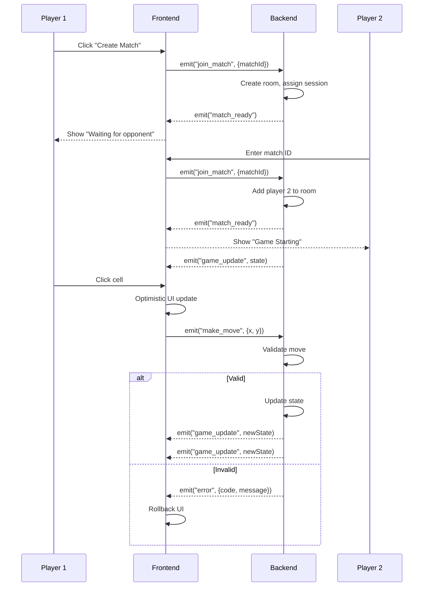
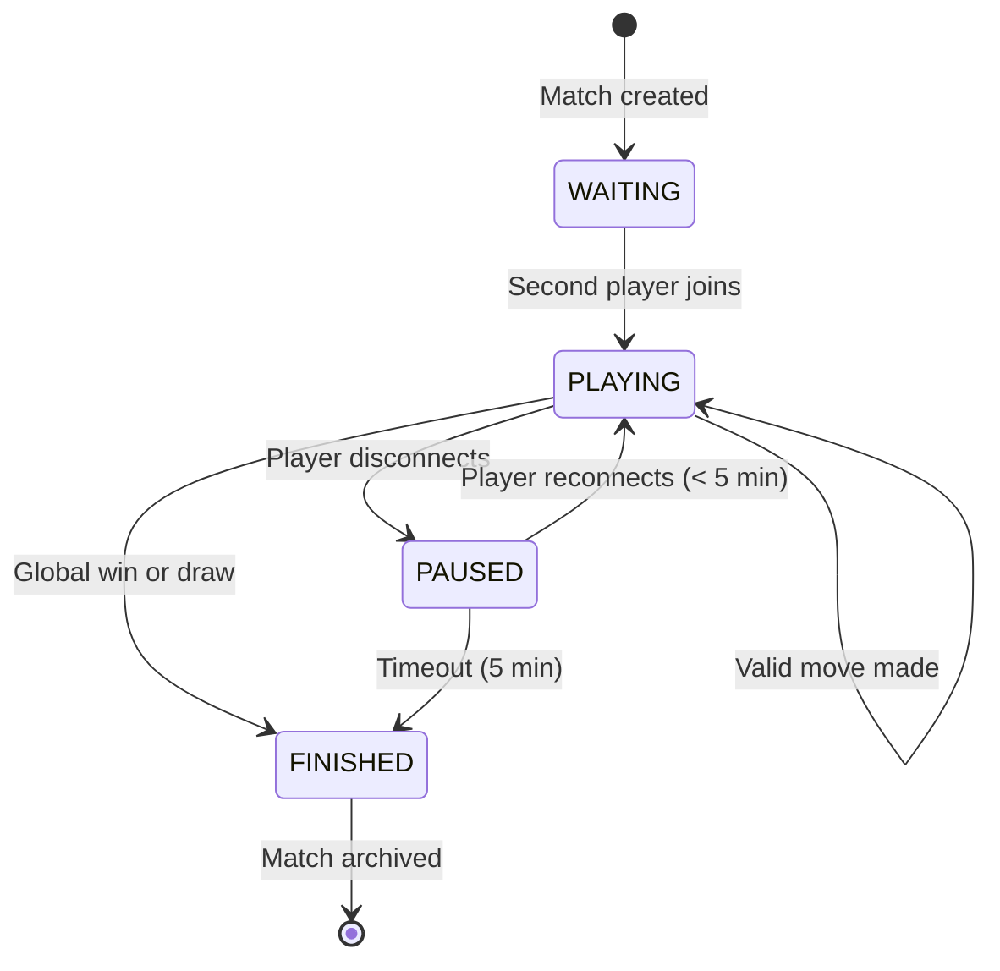
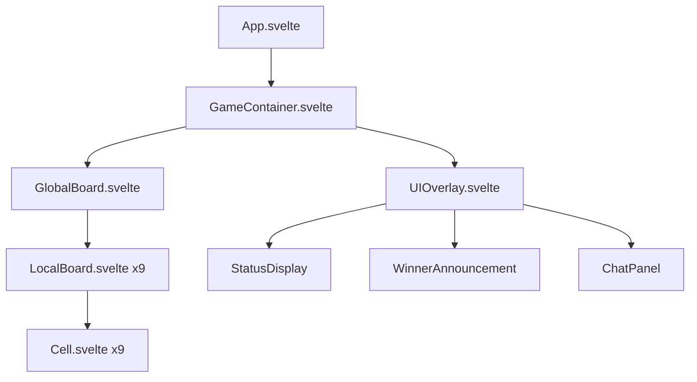
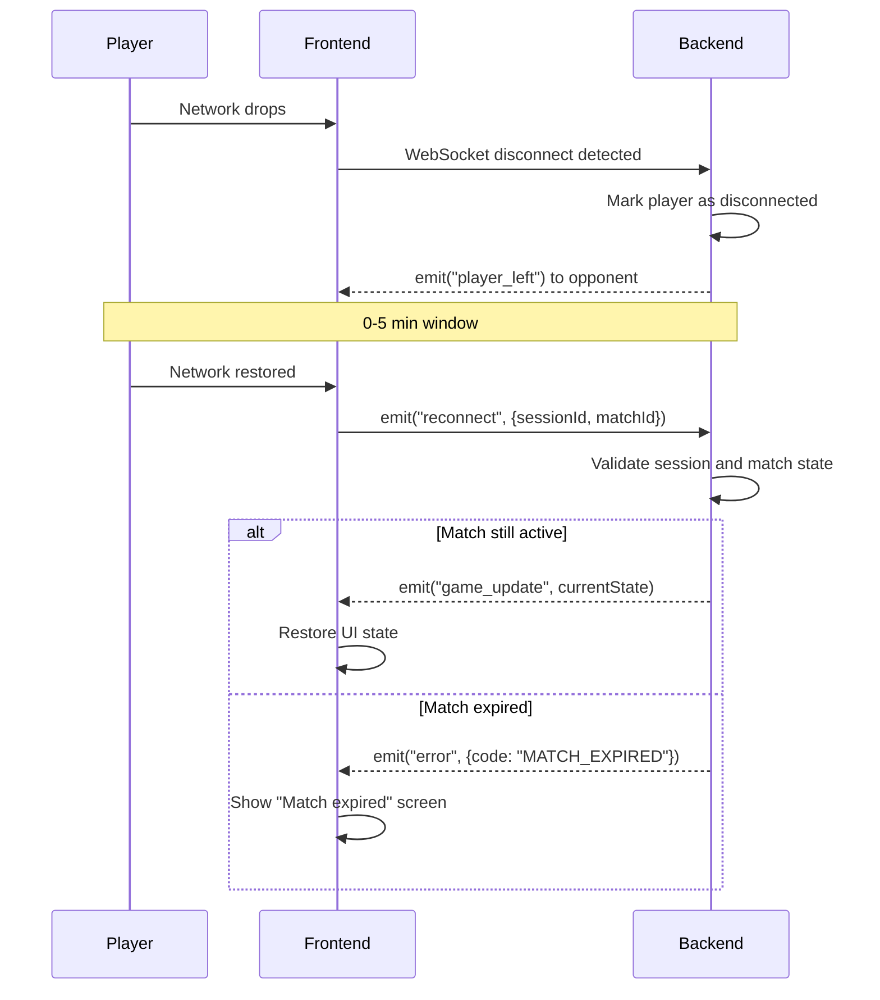

# Architecture Diagrams

## System Architecture

```mermaid
graph TB
    subgraph Client[Vercel - Frontend]
        A[SvelteKit App]
        B[Svelte Stores]
        C[Socket.io Client]
    end

    subgraph Server[Railway - Backend]
        D[Express Server]
        E[Socket.io Server]
        F[Match Manager]
        G[Game Engine]
    end

    subgraph Data[(Data Layer)]
        H[(PostgreSQL)]
    end

    A --> B
    B --> C
    C <-->|WebSocket| E
    E --> D
    D --> F
    F --> G
    D --> H
```

## WebSocket Event Sequence



## Game State Machine



## Frontend Component Tree



## Reconnection Flow


